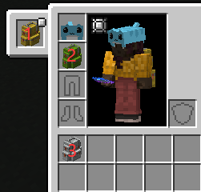
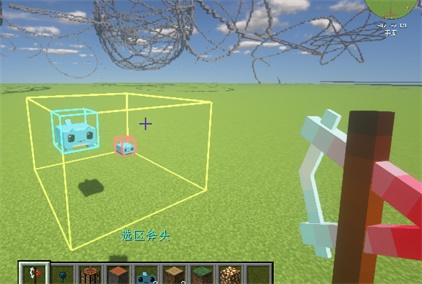
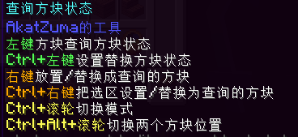
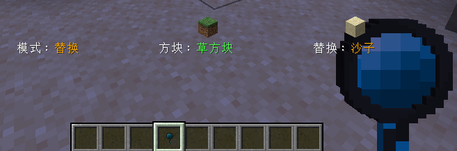
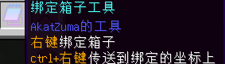
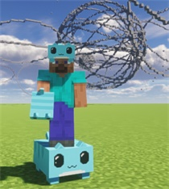
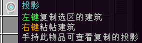
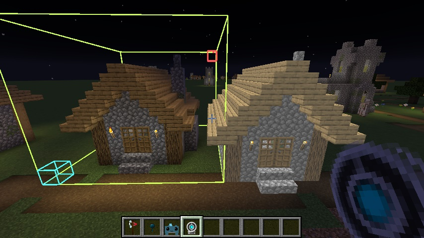
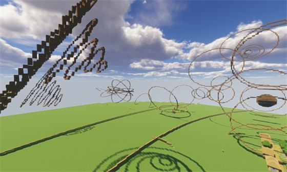

[toc]

<br>


作者：[5中生有](https://center.mcmod.cn/60332/) 、AkatZuma、[くじょう-アイ](https://center.mcmod.cn/131109/)

MCMOD：https://www.mcmod.cn/class/13584.html

### 指令列表

|  指令   | 描述  |
|  ----  | ----  |
| /a set | 设置选区内方块 |
| /a stack      | 堆叠选区内方块 |
| /a copy      | 复制 |
| /a paste      | 粘帖 |
| /a flip      | 翻转复制的内容 |
| /a replace      | 替换 |
| /a line      | 连线 |
| /a undo      | 撤销 |
| /a redo      | 撤销undo |
| /a cyl        | 实心圆形/圆柱体 |
| /a hcyl        | 空心圆形/圆柱体 |
| /a sphere     | 球 |
| /a ellipse    | 椭圆 |

| 管理员指令      |  |
|  ----  | ----  |
| /a add viplayer | 添加高级玩家 |
| /a del viplayer | 删除高级玩家 |
| /a add whitelist | 添加黑白名单 |
| /a del vipwhitelist | 删除高级玩家的黑白名单 |
| /a add replaceList | 添加替换的方块列表 |
| /a add range / viprange | 设置选区大小 |


### <font color=red>| 注意事项 </font> 
* 所有功能都只扣除背包，撤销不会返还，也不会产生掉落物
* 在别人领地内选区不会成功，会出现`选区渲染框`和`实际选区位置`不一致，请确保有权限的情况下操作

<br>

- - -

### 快捷键
`ctrl + u` 撤销（undo）


### 扣除背包
* 扣除顺序： 玩家背包 > 精妙背包 > 绑定的箱子
* 精妙背包检测顺序：饰品栏 > 胸甲栏 > 物品栏最上面一格（如图），只支持一个背包
* 绑定的箱子：不支持跨世界，需要在同一个世界内，只能绑定一个，只支持原版和精妙存储的`箱子`、`木桶`



<br>

- - -

### 工具
#### 选区工具
使用本MOD的选区工具，`左键`选取第一个点，`右键`选取第二个点。

`左/右键`空气选择`玩家头部位置`的点位
`Ctrl+滚轮`扩大/缩小选区位置1（根据玩家朝向判断）
`Alt+滚轮`扩大/缩小选区位置2



<br>

- - -
#### 查询工具



* `左键`设置方块状态，消息可以点击复制状态
* `ctrl+左键` 设置替换的方块

* `右键`：
  * 放置模式：放置一个上次查询方块，需要背包中有对应的方块物品
  * 替换模式：把指针选中的方块设置成替换的方块

* `ctrl+右键` 根据当前模式执行`放置/替换`指令， 方块为上次查询的方块
  * 放置模式：执行`/a set`指令
  * 替换模式：执行`/a replace`指令，把选区内查询的方块设置成替换的方块

* `ctrl+滚轮` 切换模式
* `ctrl+alt+滚轮` 切换两个方块的位置


<br>

- - -

#### 绑定箱子工具

* 可以绑定一个`原版`或`精妙存储`的箱子、木桶，背包中物品不足时，会从绑定的箱子中查找扣除
* `右键` 绑定箱子
* `ctrl+右键`传送到绑定的坐标（不支持跨世界，会传送到当前世界的这个坐标）

<br>

- - -

#### 建筑耗材方块(猫猫虫)


* 复制任何方块都只消耗此材料,可带到头部

* 也可以在配置文件中添加要替换的方块，比如`空气、水`等不能获取的方块可以填入，会扣除对应数量的`建筑耗材`方块

方块ID：`akatzumaworldedit:building_consumable`

● 注意：因为只消耗此MOD的物品，会产生复制方块的问题 

● `不想复制的方块`加入黑名单即可

● `不想使用复制功能`的把`此方块`加入黑名单

适用于指令`/a copy 、 /a stack`

<br>

- - -

#### 投影




<br>

- - -

### 指令
```java
//格式
/a 指令 <必填参数> [选填参数]
```

<br>

- - -

#### /a set 设置选区内方块
`/a set <方块ID>`
可以使用查询工具查看方块的状态并复制,[]内是方块的各种状态

比如：`/a set minecraft:cherry_leaves[persistent=true]`

放置一个不会枯萎的樱花树叶，默认放置的树叶是会枯萎的
<br>

- - -
#### /a stack 堆叠
默认根据玩家朝向东南西北堆叠，上下方向需要填入参数

`/a stack <堆叠次数> [方向]`
- <堆叠次数>： 数字即可，受选区范围限制
- [方向]：可选参数`up、down`

<br>

- - -

#### /a copy 复制
复制选区内的方块，使用`/a paste` 粘帖
> 复制时候玩家的站位会影响粘帖的位置和翻转，粘帖时候会根据玩家朝向来粘帖
* <font color='red'>注意</font>： 不会复制NBT属性，比如箱子里面的数据等，只复制方块状态

<br>

#### /a flip 翻转
`/a flip [up]`

* `[up]`（选填参数）上下翻转
* 向下翻转：玩家站在`选区`**下方**复制，填入参数`up`
* 向上翻转：玩家站在`选区`**上方**复制，填入参数`up`
> 位置影响参考复制↑

* 翻转复制的选区内容，不填参数默认左右翻转

* 以玩家复制时候的位置为原点翻转


<br>

#### /a paste 粘帖
`/a flip [-a]`
* 会根据玩家朝向来旋转复制的内容粘帖
* `-a` （选填参数）粘帖的时候忽略空气

<br>

- - -

#### /a replace 替换
`/a replace <被替换的方块> <替换成的方块>`
<br>
- - -

#### /a line 连线/对角线
`/a line <方块ID>`

在选区两点之间连一条线

长度限制：大于5

高度限制：大于1
<br>
- - -

### 生成指令
#### /a cyl  实心圆形/圆柱体
`/a cyl <方块ID> <半径> <高度> [x角度] [z角度]`
* `<半径>` 最小3
* `<高度>` 最小1
* `[x角度]` （选填参数）沿x轴旋转生成的圆，范围360至-360
* `[z角度]` （选填参数）沿z轴旋转生成的圆，范围360至-360

<br>

- - -

#### /a hcyl  空心圆形/圆柱体
`/a hcyl <方块ID> <半径> <高度> [x角度] [z角度]`
* `<半径>` 最小3
* `<高度>` 最小1
* `[x角度]` （选填参数）沿x轴旋转生成的圆，范围360至-360
* `[z角度]` （选填参数）沿z轴旋转生成的圆，范围360至-360



<br>

- - -

#### /a sphere  球
`/a sphere <方块ID> <半径> [-h]`
* `<半径>` 最小3
* `[-h]` （选填参数）生成空心球，不填默认生成实心的

<br>

- - -

#### /a ellipse  椭圆
`/a ellipse <方块ID> <东西半径> <南北半径> <高度> [-h]`
* `<东西半径>` 最小3，X轴
* `<南北半径>` 最小3，Z轴
* `<高度>`    最小3，Y轴
* `[-h]` （选填参数）生成空心椭圆，不填默认生成实心的

<br>

- - -

### 管理员指令
#### /a add viplayer 添加高级玩家 
`/a add viplayer <玩家名字>`

#### /a del viplayer 删除高级玩家 
`/a del viplayer <玩家名字>`
<br>

- - -

#### /a add whitelist 添加黑白名单
`/a add whitelist <数量> <方块ID>`

`数量`：
```
-1则为添加黑名单
大于0是白名单，数字为扣除的比例（比如10则为10：1，放置10个方块需要扣除背包中1个）
等于0则此方块放置时不扣除数量（无限制）
```

#### /a add vipwhitelist 添加高级玩家的黑白名单
同上，-1则为添加黑名单


#### /a del whitelist / vipwhitelist 删除黑白名单
`/a del whitelist <数量> <方块ID>`
* 数量：-1为删除黑名单
* 删除白名单需要**数量**和配置文件中的数量相同，否则会出现游戏中删除，配置文件中未删除的情况
<br>

- - -

#### /a add replaceList 添加替换的方块列表
`/a add replaceList <方块ID>`

<br>

- - -

#### /a add range 设置选区大小
`/a add range <数字>`
* 修改配置文件的选区大小，range改为viprange修改高级玩家的选区大小
<br>

- - -


### Debug

* 玩家成功执行指令后会在debug日志中记录（debug.log）

* debug日志格式如下
`[玩家名字][玩家发送的指令][玩家坐标][方块ID][选区坐标1][选区坐标2]`

部分指令在日志中没有`[方块ID]`这个参数
```log
  [Dev][a set minecraft:birch_planks][BlockPos{x=-103, y=63, z=63}][Birch Planks=Block{minecraft:birch_planks}][BlockPos{x=-107, y=64, z=63}][BlockPos{x=-107, y=65, z=62}]
```
