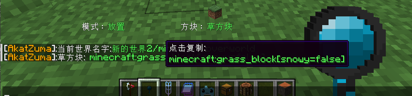
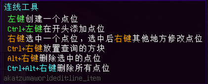
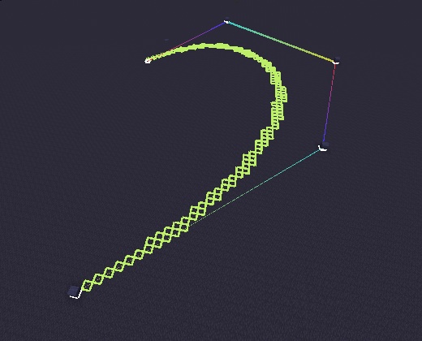
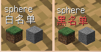

[toc]
<br>

作者：[5中生有](https://center.mcmod.cn/60332/) 、AkatZuma、[くじょう-アイ](https://center.mcmod.cn/131109/)

MCMOD：https://www.mcmod.cn/class/13584.html

<br>

- - -


### 指令列表

 指令   | 描述  |
 ----  | ----  |
[/a set](#a_set) | 设置选区内方块 |
[/a stack](#a_stack)       | 堆叠选区内方块 |
[/a copy](#a_copy)         | 复制 |
[/a paste](#a_paste)       | 粘帖 |
[/a flip](#a_flip)         | 翻转复制的内容 |
[/a replace](#a_replace)       | 替换 |
[/a line](#a_line)         | 连线 |
[/a undo](#a_undo)         | 撤销 |
[/a redo ](#a_redo)        | 撤销undo |
[/a cyl](#a_cyl)            | 实心圆形/圆柱体 |
[/a hcyl](#a_hcyl )         | 空心圆形/圆柱体 |
[/a sphere](#a_sphere)      | 球 |
[/a ellipse](#a_ellipse)    | 椭圆 |
[/a brush](#a_brush)        | 笔刷 |
[/a mask](#a_mask)          | 蒙版 |
[/a brush unbind](#a_brush_unbind) | 解除绑定笔刷 |

| 管理员指令      |  |
|  ----  | ----  |
[/a add viplayer](#a_add_viplayer) | 添加高级玩家 |
[/a del viplayer](#a_del_viplayer) | 删除高级玩家 |
[/a add vipwhitelist](#a_add_vipwhitelist) | 添加黑白名单 |
[/a del vipwhitelist](#a_del_vipwhitelist) | 删除高级玩家的黑白名单 |
[/a add replaceList](#a_add_replacelist) | 添加替换的方块列表 |
[/a add range / viprange](#a_add_range) | 设置选区大小 |
[/a world](#a_world)| 获取当前世界名称

 其他指令      |  |
  ----  | ----  |
[/a update](#a_update) | 设置方块是否更新 |


### <font color=red>| 注意事项 </font> 
* 所有功能都只扣除背包，撤销不会返还，也不会产生掉落物
* 在别人领地内选区不会成功，会出现`选区渲染框`和`实际选区位置`不一致，请确保有权限的情况下操作

<br>

- - -

### 快捷键
<kbd>ctrl</kbd> + <kbd>u</kbd> 撤销（undo）


### 扣除背包
> * 扣除顺序： 玩家背包 -> 精妙背包 -> 绑定的箱子
> * 精妙背包检测顺序：饰品栏 -> 胸甲栏 -> 物品栏最上面一格（如图），只支持一个背包
> * 绑定的箱子：不支持跨世界，需要在同一个世界内，只能绑定一个，只支持原版和精妙存储的`箱子`、`木桶`


<br>

- - -

### 工具
#### 选区工具
使用本MOD的选区工具，`左键`选取第一个点，`右键`选取第二个点。

 
<kbd>左/右键</kbd>空气选择`玩家头部位置`的点位

<kbd>Ctrl+滚轮</kbd>扩大/缩小选区位置1（根据玩家朝向判断）

<kbd>Alt+滚轮</kbd>扩大/缩小选区位置2


<br>

- - -
#### 查询工具




* <kbd>左键</kbd>设置方块状态，消息可以点击复制状态到剪贴板
* <kbd>ctrl+左键</kbd> 设置替换的方块

* <kbd>右键</kbd>：
  * 放置模式：放置一个上次查询方块，需要背包中有对应的方块物品
  * 替换模式：把指针选中的方块设置成替换的方块

* <kbd>ctrl+右键</kbd> 根据当前模式执行`放置/替换`指令， 方块为上次查询的方块
  * 放置模式：执行`/a set`指令
  * 替换模式：执行`/a replace`指令，把选区内查询的方块设置成替换的方块

* <kbd>ctrl+滚轮</kbd> 切换模式
* <kbd>ctrl+alt+滚轮</kbd> 切换两个方块的位置


<br>

- - -

#### 绑定箱子工具

* 可以绑定一个`原版`或`精妙存储`的箱子、木桶，背包中物品不足时，会从绑定的箱子中查找扣除
* <kbd>右键</kbd> 绑定箱子
* <kbd>ctrl+右键</kbd>传送到绑定的坐标（不支持跨世界，会传送到当前世界的这个坐标）

<br>

- - -

#### 建筑耗材方块(猫猫虫)


* 复制任何方块都只消耗此材料，可穿戴到头部

* 也可以在配置文件中添加要替换的方块，比如`空气、水`等不能获取的方块可以填入，会扣除对应数量的`建筑耗材`方块

方块ID：`akatzumaworldedit:building_consumable`

**注意**：
- 因为只消耗此MOD的物品，会产生复制方块的问题 

- `不想复制的方块`加入黑名单即可

- `不想使用复制功能`的把`此方块`加入黑名单

适用于指令`/a copy 、 /a stack`，使用时只扣除对应数量的此方块

<br>

- - -

#### 投影


<br>

- - -


#### 连线工具


]

<br>

- - -

### 指令
#### 指令格式
```java
//格式
/a 指令 <必填参数> [选填参数]
```

<br>

- - -

<a id="a_set"></a>
#### /a set 设置选区内方块
`/a set <方块ID>`
将选区设置成指定的方块

- 可以使用`查询工具`查看方块的状态并复制，[ ]内是方块的各种状态

- 比如：`/a set minecraft:cherry_leaves[persistent=true]`

- 放置一个不会枯萎的樱花树叶，默认放置的树叶是会枯萎的
<br>

- - -

<a id="a_stack"></a>
#### /a stack 堆叠
`/a stack <堆叠次数> [方向]`
默认根据玩家朝向东南西北堆叠，上下方向需要填入参数

- <堆叠次数>： 数字即可，受选区范围限制
- [方向]：(选填参数)`up、down`

<br>

- - -


<a id="a_copy"></a>
#### /a copy 复制

* 复制选区内的方块，使用`/a paste` 粘帖
* 手拿本模组的投影工具来显示投影，可以更方便的粘帖
> 复制时候玩家的站位会影响粘帖的位置和翻转，粘帖时候会根据玩家朝向来粘帖
* <font color='red'>注意</font>： 不会复制NBT属性，比如箱子里面的数据等，只复制方块状态

<br>

<a id="a_flip"></a>
#### /a flip 翻转
`/a flip [up]`
默认左右翻转

* `[up]`（选填参数）上下翻转
* 向下翻转：玩家站在`选区`**下方**复制，填入参数`up`
* 向上翻转：玩家站在`选区`**上方**复制，填入参数`up`
> 位置影响参考复制↑

* 翻转复制的选区内容，不填参数默认左右翻转

* 以玩家复制时候的位置为原点翻转


<br>

<a id="a_paste"></a>
#### /a paste 粘帖
`/a paste [-a]`
* 会根据玩家朝向来旋转复制的内容粘帖
* `-a` （选填参数）粘帖的时候忽略空气

<br>

- - -

<a id="a_replace"></a>
#### /a replace 替换
`/a replace <方块1> <方块2>`

* 把选区内的`方块1`替换成`方块2`

<br>

- - -

<a id="a_line"></a>
#### /a line 连线/对角线
`/a line <方块ID>`

在选区两点之间连一条线

长度限制：大于5

高度限制：大于1
<br>
- - -


<a id="a_undo"></a>
### /a undo 撤销
`/a undo`
撤销上一次操作，撤销次数在配置文件中设置

<a id="a_redo"></a>
### /a redo 撤销undo
`/a redo`
撤销上一次undo操作


### 生成指令
<a id="a_cyl"></a>
#### /a cyl  实心圆形/圆柱体
`/a cyl <方块ID> <半径> <高度> [x角度] [z角度]`
* `<半径>` 最小3
* `<高度>` 最小1
* `[x角度]` （选填参数）沿x轴旋转生成的圆，范围360至-360
* `[z角度]` （选填参数）沿z轴旋转生成的圆，范围360至-360

<br>

- - -

<a id="a_hcyl"></a>
#### /a hcyl  空心圆形/圆柱体
`/a hcyl <方块ID> <半径> <高度> [x角度] [z角度]`
* `<半径>` 最小3
* `<高度>` 最小1
* `[x角度]` （选填参数）沿x轴旋转生成的圆，范围360至-360
* `[z角度]` （选填参数）沿z轴旋转生成的圆，范围360至-360


<br>

- - -

<a id="a_sphere"></a>
#### /a sphere  球
`/a sphere <方块ID> <半径> [-h]`
* `<半径>` 最小3
* `[-h]` （选填参数）生成空心球，不填默认生成实心的

<br>

- - -

<a id="a_ellipse"></a>
#### /a ellipse  椭圆
`/a ellipse <方块ID> <东西半径> <南北半径> <高度> [-h]`
* `<东西半径>` 最小3，X轴
* `<南北半径>` 最小3，Z轴
* `<高度>`    最小3，Y轴
* `[-h]` （选填参数）生成空心椭圆，不填默认生成实心的

<br>

- - -

### 笔刷

* 手持任意物品输入对应指令绑定笔刷，右键即可放置对应形状
* 放置位置为准心对准的方块，右键最远探测距离为`120`格
* 无论是否绑定蒙版，每次右键放置前都会从背包扣除整个形状数量的方块
* 尽量选择右键没有功能的物品绑定物品
* 绑定后会在左下角显示绑定的形状名称和添加的蒙版方块

>绑定的形状和生成指令类似

<a id="a_brush_sphere"></a>
#### /a brush sphere 球形笔刷
`/a brush sphere <方块ID> <半径> [-h]`
* `[-h]` （选填参数）空心球形

<br>

<a id="a_brush_cyl"></a>
#### /a brush cyl 圆柱笔刷
`/a brush cylinder <方块ID> <半径> <高度> [-h]`
* `[-h]` （选填参数），空心圆柱，不填默认生成实心圆柱

<br>

<a id="a_brush_ellipse"></a>
#### /a brush ellipse 椭圆笔刷
`/a brush ellipse <方块ID> <东西半径> <南北半径> <高度> [-h]`
* `[-h]` （选填参数）空心椭圆

<br>

<a id="a_brush_paste"></a>
#### /a brush paste [-a]粘贴板笔刷
参考复制功能，把选区的内容绑定到笔刷，每次右键粘帖
* `[-a]` （选填参数），粘帖的时候忽略空气

<br>

<a id="a_brush_unbind"></a>
#### /a brush unbind 解绑笔刷
解绑当前绑定的笔刷

<br>

### 蒙版
给当前手中的`笔刷物品`绑定蒙版，右键放置时只影响对应的方块
* 无论放置了多少方块，扣除的时候还是按整个形状扣除
* 会在左下角显示绑定的方块，没有材质的物品目前不会显示（比如空气）
* 黑白名单同时只存在一种，需要清空当前蒙版的请重新绑定笔刷

<a id="a_mask"></a>
#### /a mask 设置白名单蒙版
`/a mask <方块ID>`
* 白名单：只影响此类型的方块，其他方块不影响
* 比如：添加了草方块到白名单，那么使用笔刷的时候只会替换草方块

<a id="a_mask_not"></a>
#### /a mask not 设置黑名单蒙版
`/a mask not <方块ID>`
* 黑名单：影响除此类型的方块
* 比如：添加了空气到黑名单，那么除了空气，其他的方块都会被替换
<br>

- - -

### 管理员指令

<a id="a_add_viplayer"></a>
#### /a add viplayer 添加高级玩家 
`/a add viplayer <玩家名字>`

<a id="a_del_viplayer"></a>
#### /a del viplayer 删除高级玩家 
`/a del viplayer <玩家名字>`
<br>

- - -

<a id="a_add_whitelist"></a>
#### /a add whitelist 添加黑白名单
`/a add whitelist <数量> <方块ID>`

`数量`：
```
-1则为添加黑名单
大于0是白名单，数字为扣除的比例（比如10则为10：1，放置10个方块需要扣除背包中1个）
等于0则此方块放置时不扣除数量（无限制）
```

<a id="a_add_vipwhitelist"></a>
#### /a add vipwhitelist 添加高级玩家的黑白名单
同上，-1则为添加黑名单

<a id="a_del_whitelist"></a>
#### /a del whitelist / vipwhitelist 删除黑白名单
`/a del whitelist <数量> <方块ID>`
* 数量：-1为删除黑名单
* 删除白名单需要**数量**和配置文件中的数量相同，否则会出现游戏中删除，配置文件中未删除的情况
<br>

- - -

<a id="a_add_replaceList"></a>
#### /a add replaceList 添加替换的方块列表
`/a add replaceList <方块ID>`
添加需要替换的方块到配置文件
- 比如`空气、水`等不能获取的方块可以填入，会扣除对应数量的`建筑耗材`方块

<br>

- - -

<a id="a_add_range"></a>
#### /a add range 设置选区大小
`/a add range <数字>`
* 修改配置文件的选区大小，range改为viprange修改高级玩家的选区大小
<br>

- - -

<a id="a_world"></a>
#### /a world 获取当前世界的名字
`/a world`

可以复制名字填入配置文件的黑名单中

<br>

- - -

### 其他普通指令

<a id="a_update"></a>
#### /a update
放置方块的时候是否更新状态

- `开启`后放置方块会更新相邻方块的状态，比如`栏杆、楼梯`等有多种状态的方块
- 默认不开启，执行一次永久开启，再次执行永久关闭，重复执行指令可以开关
- 关闭可以提升放置方块的速度，每个玩家可以自行选择是否开启

<br>

- - -

### 日志

* 玩家成功执行指令后会在日志中记录（路径：config\AkatZumaWorldEdit\logs）

* 日志格式如下
`[玩家名字][玩家发送的指令][玩家坐标][方块ID][选区坐标1][选区坐标2]`

部分指令在日志中没有`[方块ID]`这个参数
```log
  [Dev][a set minecraft:birch_planks][BlockPos{x=-103, y=63, z=63}][Birch Planks=Block{minecraft:birch_planks}][BlockPos{x=-107, y=64, z=63}][BlockPos{x=-107, y=65, z=62}]
```
